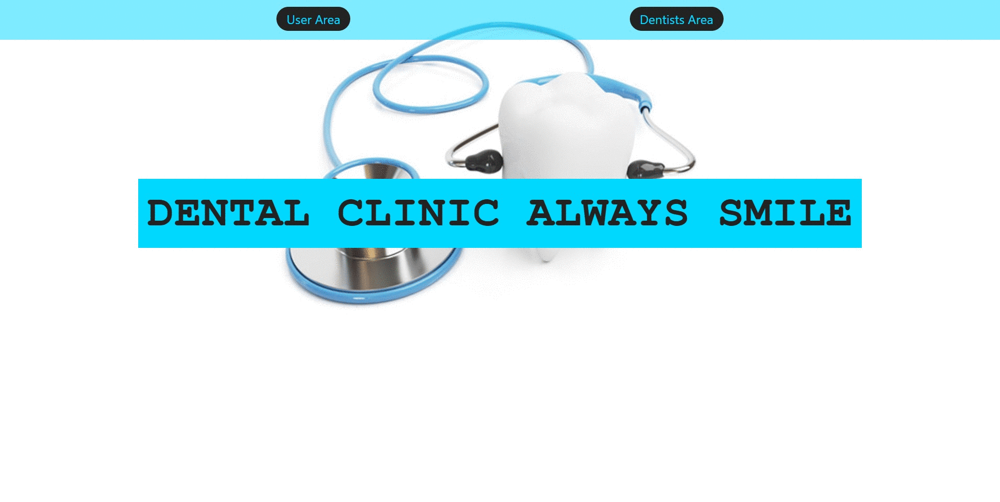

---
# Dental Clinic 🦷
## What is dental-clinic-frontend? 🤔
AppAppointments is an application to manage the appointments that a user has. In this case, it is about appointments for a dental clinic.The dentist is in charge of managing the appointments.
> Note: This repository is the frontend of the application.
> Backend is here [repository](https://github.com/Cheroki84/dental-clinic-backend-laravel)
---
## Technologies used 🛠️
- JavaScript
- React
- Redux
- SCSS
- Axios
- Github
- Heroku
---
## Steps to run the application 🚀
> Note: The application is uploaded to [Heroku](https://appappointmentsfrontend.herokuapp.com/)
---
## Some working samples ⚙️
#### Register and login of a client

---
#### Login of a dentist, view appointments and create one

---

